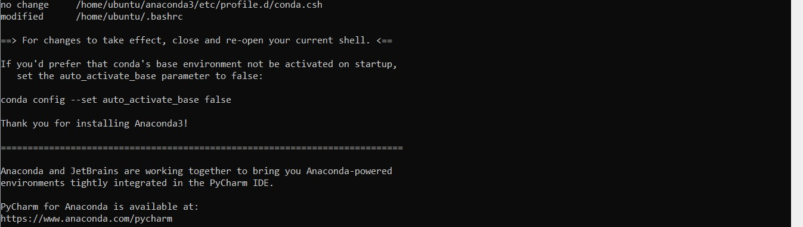

[Inspired from ]

# Step 0 : Objective
- Install Jupyter on a publicly accessible Ubuntu server (AWS EC2 instance).
- Configure two different Python virtual environments with Python3.6 and Python3.8 interpreters respectively
- Each Python virtual environment runs with its own specific interpreter, libraries, scripts
- As such each virtual environment is isolated from others as well as from the default Python environment included in the operating system

# Step 1 : Launch Ubuntu Server instance on AWS inside a "public subnet", configure its Route Table, assign Public IP & Security Group
- Inside a VPC, create a suitable subnet.
- Configure its route table to allow routing to 0.0.0.0/0 through Internet Gateway.
- Create a security group to allow incoming connections on port 22 (SSH), port 8888 (port on which Jupyter server will run) and optionally ICMP (ping) port.
- Launch Ubuntu 18.04 server instance (save private key "My_key_pair.pem"), assign VPC, subnet, security group created above and public IP aaa.bbb.ccc.ddd.

# Step 2 : Connect to Server by SSH, install PIP (package manager) and Jupyter
In local CLI (Linux machine in this case), run :
- $sudo chmod 400 My_key_pair.pem : Protect private key by making it read-only
- $sudo ssh -i "My_key_pair.pem" ubuntu@aaa.bbb.ccc.ddd  :  Connect to server by SSH, default user "ubuntu" --> Now connected by SSH to the Server
- $sudo apt-get update : Download the package lists for all packages on the server that need an upgrade
- $sudo apt-get upgrade -y : Fetch on the server the new packages available and install them 

- $sudo apt install python3-pip : Install pip - python package manager
- $sudo pip3 --version    : Display pip version
- $sudo -H pip3 install jupyter  : Install Jupyter using PIP
- $sudo jupyter --version  : Check Jupyter version
- $sudo nohup jupyter notebook --allow-root --ip 0.0.0.0 &  || Launch jupyter with root access, bind it with all IPs "0.0.0.0" to enable access from any public IP, type "&" to continue running Jupyter in background even after closing CLI, write the output of this command to the file "nohup"
- $sudo cat nohup.out  || Display the content of the "nohup" file present in current directory and copy the URL containing the token : 

- Replace the private IP address by the public IP assigned to the server : http://aaa.bbb.ccc.ddd:8888/?token=7a657d52b4cfdf77a93de126b589f90bf0d277f7076f8020

- Paste the output link in a web browser to access Jupyter Notebook. Successful ! At this stage, Jupyter Notebook app is up and running with the default Python3 environment 
  provided in the OS.

 
# Step 3 (Final) : Configure Several Python Virtual Environments and link them to Jupyter

The tool chosen here for Python virtual environment creation is Conda from the Anaconda repository, which natively supports env. creation with different Python versions.
Other options (not covered here) typically involve using "pip" (the recommended package installer) and "pew" (python environment wrapper), or pip and virtualenv. 
Read more here : https://www.anaconda.com/understanding-conda-and-pip/

- Get the URL of the latest Anaconda open-source distribution for Linux from : https://www.anaconda.com/distribution/#download-section 
- $sudo curl -O https://repo.anaconda.com/archive/Anaconda3-2019.10-Linux-x86_64.sh  : Download Anaconda to the server. Downloaded version here is : "Anaconda3-2019.10-Linux-x86_64.sh"
- $sudo bash Anaconda3-2019.10-Linux-x86_64.sh  : Install Anaconda. Chosen directory : /home/ubuntu/anaconda3

- Launch Terminal from Jupyter Web Interface

- $conda create -n my-python3.6-virtualenv python=3.6  : Create virtual environment with Python version 3.6

- $conda create -n my-python3.8-virtualenv python=3.8  : Create virtual environment with Python version 3.8

- $conda activate my-python3.6-virtualenv  : Activate virtual environment

- $conda activate my-python3.8-virtualenv  : Activate virtual environment

- $python3 -m ipykernel install --user --name my-python3.6-virtualenv  : Link virtual environment to Jupyter. Successful !

- $python3 -m ipykernel install --user --name my-python3.8-virtualenv  : Link virtual environment to Jupyter. Successful !

- Two isolated virtual environments have successfully been created, each with a different Python version. 

